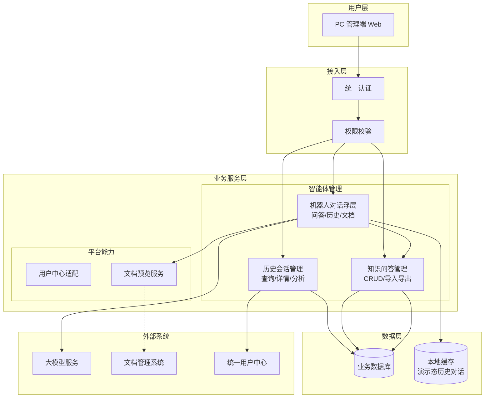
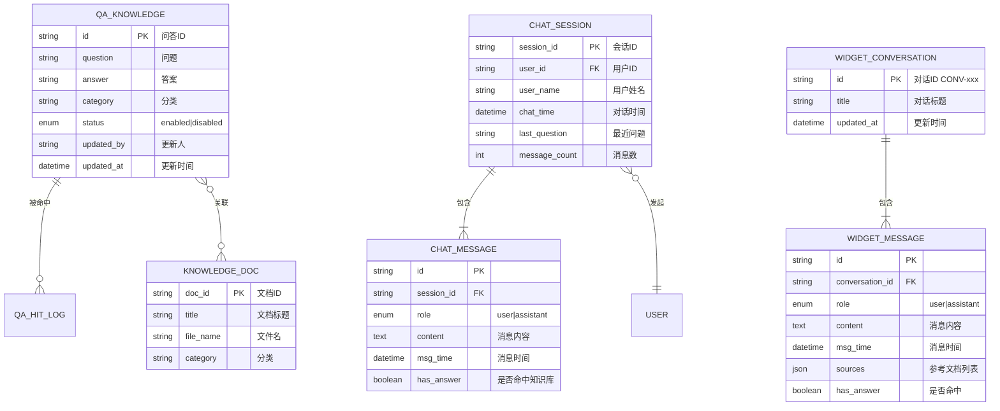
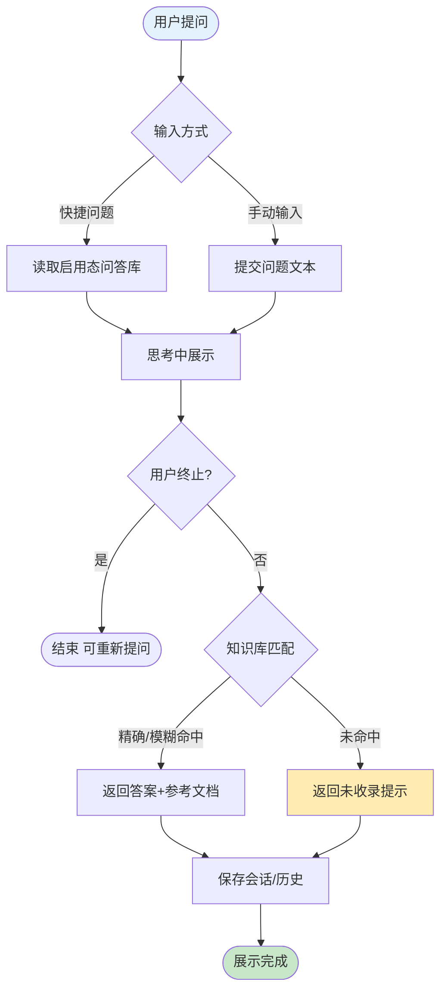
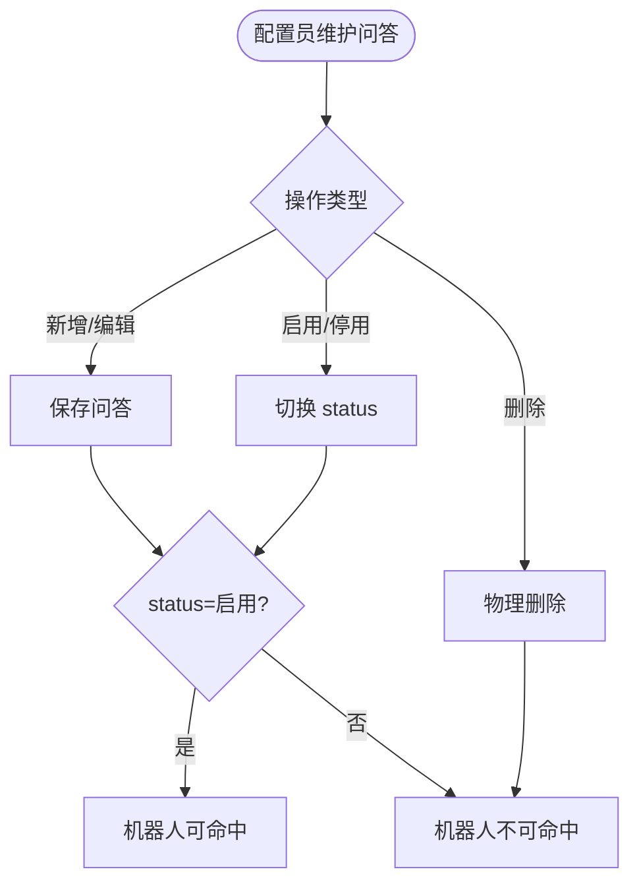
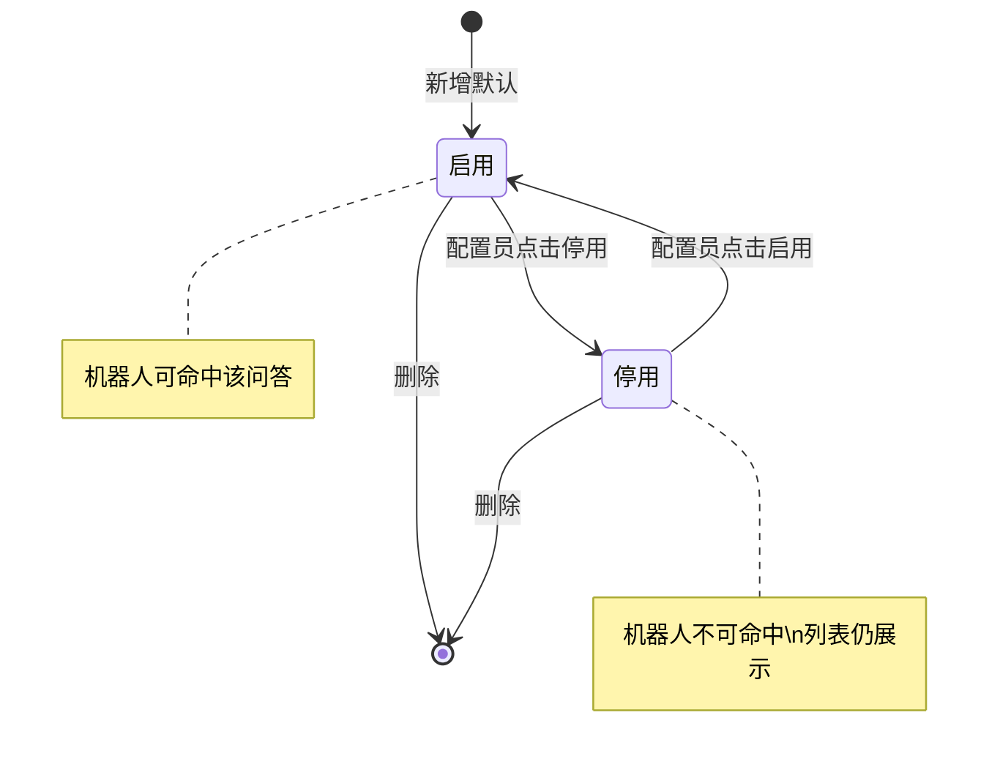

# 智能体管理 PRD

| PRD 审核人 | 【待补充】 |
| --- | --- |
| 重要性 | 中 |
| 紧迫性 | 中 |
| 需求方 | 基础功能 / 智能体管理 |
| PRD 编写人 | 【待补充】 |
| PRD 提交日期 | 2026-05-22 |
| 需求级别 | **L3（模块级）** |
| 产品定型 | **企业自研系统 × 业务管理型（含工具型对话能力）** |

## PRD 修改记录

| 变更时间 | 变更内容 | 变更提出部门与理由 | 修改人 | 审核人 | 版本号 |
| --- | --- | --- | --- | --- | --- |
| 2026-05-22 | 按 prd-writing-toolkit（create-prd）L3 规范重写全文 | 智能体管理模块需求沉淀 | 【待补充】 | 【待补充】 | v2.0 |
| — | 初版功能字段梳理 | — | — | — | v1.0 |

---

## 1、项目背景

> 💡 方法论提示：《决胜B端》三层业务调研框架（战略层→战术层→执行层）

### 1.1 业务现状

移动市场运营平台面向省公司及地市运营人员，提供指标洞察、策略调度、客群标签等能力。随着知识查询助手（机器人）在前台业务场景中的使用，运营人员需要通过自然语言查询指标口径、系统操作说明、策略流程等知识。

当前智能体管理作为「基础功能」子模块，承担三类后台职责：

1. **历史会话管理**：查看用户与机器人的对话记录，支撑运营分析与问题复盘。
2. **知识问答管理**：维护标准问答库，作为机器人回答的核心知识来源。
3. **机器人对话能力**：在管理端提供右下角浮层，供管理员体验与验证问答效果。

演示环境已实现上述页面与浮层交互；正式环境需对接用户中心、会话服务、知识库服务及文档系统。

### 1.2 面临问题

1. **知识分散、回答不一致**：指标口径、操作说明散落在文档与口口相传中，机器人无法稳定命中标准答案。
2. **会话不可追溯**：缺少统一的会话查询与分析能力，无法识别高频问题与无答案问题。
3. **知识维护效率低**：问答条目缺少统一的增删改查、导入导出与启停机制。
4. **管理端体验割裂**：配置人员无法在管理页面直接体验机器人问答效果。

### 1.3 解决思路

建设「智能体管理」模块，形成 **「知识配置 → 机器人问答 → 会话沉淀 → 问题分析」** 闭环：

- 知识问答管理维护标准问答库；
- 机器人对话浮层读取启用态问答并返回答案与文档来源；
- 历史会话管理汇聚用户对话记录并支持问题分析导出；
- 通过启用/停用控制问答是否可被命中。

### 1.4 决策依据

| 依据 | 说明 |
| --- | --- |
| 业务诉求 | 降低运营人员咨询口径与操作类问题的沟通成本 |
| 平台定位 | 与移动市场运营平台「基础功能」模块一致，服务内部运营与配置人员 |
| 演示验证 | 当前演示版已覆盖核心页面与浮层交互，具备 PRD 细化基础 |
| 【待补充】 | 正式环境会话量、无答案率等基线数据 |

---

## 2、需求基本情况

> 💡 方法论提示：《决胜B端》需求发现十三要素五步法 — 分析角色 + 了解基本场景

| 要素 | 内容 |
| --- | --- |
| **需求提出人** | 【待补充】（预计：省公司运营管理部门 / 数字化产品负责人） |
| **功能使用人** | 系统配置员、省公司运营人员、地市运营人员（管理端） |
| **受影响人** | 全体使用知识查询助手的业务用户（问答质量、命中结果） |
| **场景描述** | 见下方核心场景 |
| **发生频率** | 知识维护：周级；会话查询与分析：日级；【待补充：正式频次】 |
| **核心痛点** | 知识难维护、会话难追溯、无答案问题难发现 |
| **需求价值** | 提升机器人回答准确率，缩短运营咨询响应链路，支撑知识库持续优化 |

### 核心场景描述

**场景1：配置员维护知识问答**

- **人物**：系统配置员（如李敏）
- **时间**：新指标上线或口径变更后
- **地点**：PC 端 · 知识问答管理页
- **起因**：用户频繁咨询同一类问题，需补充标准问答
- **经过**：新增/编辑问答，设置分类与启用状态，必要时批量导入
- **结果**：机器人可命中新问答，用户获得标准答案

**场景2：运营人员分析助手使用情况**

- **人物**：省公司运营人员（如张明）
- **时间**：月度运营复盘
- **地点**：PC 端 · 历史会话管理 · 知识助手问题分析
- **起因**：需了解高频问题与无答案问题以优化知识库
- **经过**：按时间区间分析会话，查看 TOP10 高频问题，导出无答案问题清单
- **结果**：形成知识库优化待办

**场景3：管理员体验机器人问答**

- **人物**：配置员或运营人员
- **时间**：配置问答后即时验证
- **地点**：智能体管理任意页面 · 右下角 AI 助手浮层
- **起因**：需确认问答命中与文档来源展示是否正确
- **经过**：点击快捷问题或手动提问，查看思考过程、答案与参考文档
- **结果**：验证通过后再发布或调整知识条目

---

## 4、项目收益目标

> 💡 方法论提示：SMART 原则（企业自研侧重效率与采纳）

### 4.1 项目目标

| 目标类型 | 目标描述 | 衡量指标 | 目标值 | 达成时限 |
| --- | --- | --- | --- | --- |
| 核心业务目标 | 提升机器人问答命中率 | 有标准答案的提问占比 | 【待补充】 | 上线后 3 个月 |
| 效率目标 | 降低口径类人工咨询量 | 相关工单/咨询次数下降 | 【待补充】 | 上线后 3 个月 |
| 体验目标 | 管理端可自助维护与验证知识 | 配置员满意度 / 功能采纳率 | 【待补充】 | 上线后 1 个月 |

### 4.2 验收标准

1. 历史会话管理支持按用户/时间查询会话列表，并可查看完整对话详情。
2. 知识问答管理支持问答的增删改查、启用/停用、批量导入导出。
3. 机器人浮层支持开场白、快捷提问、思考过程、终止回答、参考文档预览。
4. 机器人浮层支持历史对话的检索、标题编辑、删除与详情回看。
5. 问题分析支持高频问题、无答案问题的统计与 CSV 导出。
6. 问答「停用」后，机器人不再命中该条问答（状态联动验收）。

### 4.3 成功标准

> 上线后 3 个月内：

1. 无答案问题占比较基线下降 【待补充】%。
2. 知识问答库启用条目数 ≥ 【待补充】 条，且覆盖 TOP10 高频问题。
3. 管理端机器人浮层周活跃使用人数 ≥ 【待补充】 人。

---

## 5、项目方案概述

### 5.1 功能清单（本期）

| 子模块 | 页面/能力 | PC 端 | 说明 |
| --- | --- | --- | --- |
| 历史会话管理 | 会话列表 + 查询 | ✓ | 只读管理 |
| 历史会话管理 | 对话详情弹窗 | ✓ | 只读 |
| 历史会话管理 | 知识助手问题分析弹窗 | ✓ | 统计 + 导出 |
| 知识问答管理 | 问答列表 + 查询 | ✓ | 增删改查 |
| 知识问答管理 | 问答详情/表单/删除弹窗 | ✓ | 配置维护 |
| 知识问答管理 | 批量导入/导出 | ✓ | CSV |
| 机器人对话 | 右下角 AI 助手浮层 | ✓ | 挂载于智能体管理三页 |
| 机器人对话 | 文档预览页 | ✓ | 新标签页 |

---

## 6、项目范围

### 6.1 涉及系统

| 系统名称 | 关系类型 | 影响描述 | 责任方 |
| --- | --- | --- | --- |
| 移动市场运营平台（本系统） | 主体 | 新增/改造智能体管理模块 | 产品 + 研发 |
| 统一用户中心 | 数据来源 | 提供用户 ID、姓名 | 【待补充】 |
| 知识库/问答服务 | 数据主体 | 存储问答配置、命中逻辑 | 【待补充】 |
| 会话服务 | 数据主体 | 存储用户会话与消息 | 【待补充】 |
| 文档管理系统 | 数据来源 | 提供参考文档预览与下载 | 【待补充】 |
| 大模型服务 | 能力依赖 | 问答生成、思考过程（正式环境） | 【待补充】 |

### 6.2 影响范围

- **用户影响**：配置员、运营人员使用新菜单；全体业务用户间接受问答质量影响。
- **流程影响**：知识维护由分散文档维护转为集中问答配置；新增会话分析与导出流程。
- **数据影响**：新增问答实体、会话实体；机器人本地历史演示态与正式服务端存储需对齐方案。
- **上下游影响**：机器人回答依赖知识问答管理启用态数据；问题分析依赖会话落库完整性。

### 6.3 不在本期范围内

1. **问答评价管理**（点赞/点踩）：已有独立页面，本 PRD 不展开，仅作为后续联动参考。
2. **前台业务页面全局挂载机器人**：本期仅智能体管理三页演示挂载。
3. **大模型微调与训练**：本期以知识库命中 + 【待补充】大模型增强为边界。
4. **多租户/地市数据隔离策略**：【待补充】是否按组织架构隔离会话与配置。

---

## 10、功能需求

### 10.1 产品框架概述

#### 10.1.1 应用架构图

#### 10.1.2 数据模型图

**实体说明补充**

| 实体 | 关键属性说明 | 数据来源 |
| --- | --- | --- |
| QA_KNOWLEDGE | 机器人命中核心表 | 知识问答管理维护 |
| CHAT_SESSION / CHAT_MESSAGE | 用户真实会话 | 会话服务落库；【待补充】同步策略 |
| KNOWLEDGE_DOC | 答案参考文档 | 文档管理系统 / 预置文档库 |
| WIDGET_CONVERSATION | 管理端浮层历史 | 演示：localStorage；正式：【待补充】 |

#### 10.1.3 核心业务流程图

**流程A：用户提问 → 机器人回答**

**流程B：问答配置 → 命中生效**

#### 10.1.4 状态机图

**问答知识状态（QA_KNOWLEDGE.status）**

| 当前状态 | 触发事件 | 目标状态 | 操作角色 | 备注 |
| --- | --- | --- | --- | --- |
| — | 新增保存 | 启用 | 配置员 | 默认启用 |
| 启用 | 停用 | 停用 | 配置员 | 立即失效 |
| 停用 | 启用 | 启用 | 配置员 | 立即生效 |
| 启用/停用 | 删除 | — | 配置员 | 二次确认 |

#### 10.1.5 功能清单

| 子系统 | 页面 | PC 端 | H5 端 | App 端 | 说明 |
| --- | --- | --- | --- | --- | --- |
| 智能体管理 | 历史会话管理 | ✓ | — | — | 列表+分析 |
| 智能体管理 | 知识问答管理 | ✓ | — | — | 配置中心 |
| 智能体管理 | 机器人对话浮层 | ✓ | — | — | 非菜单页 |
| 智能体管理 | 文档预览 | ✓ | — | — | 新窗口 |

---

### 10.2 产品需求详解

#### 10.2.1 历史会话管理

##### 10.2.1.1 业务流程图

配置员进入页面 → 设置筛选条件 → 查询会话列表 → 点击「查看详情」查看完整对话；或点击「知识助手问题分析」进行区间统计与导出。

##### 10.2.1.2 页面交互

**历史会话管理 — 会话列表**

**查询条件：**

| 字段名称 | 默认值 | 字段类型 | 数据来源 | 备注 |
| --- | --- | --- | --- | --- |
| 会话/用户 | 空 | 文本 | 用户输入 | 模糊匹配会话ID、用户ID、用户姓名 |
| 对话开始 | 【待补充】默认月初 | 日期 | 用户选择 | 下限 |
| 对话结束 | 【待补充】默认月末 | 日期 | 用户选择 | 上限 |

**列表字段：**

| 字段名称 | 字段类型 | 开放修改 | 必输项 | 数据来源 | 备注 |
| --- | --- | --- | --- | --- | --- |
| 会话ID | 文本 | 否 | — | 系统生成 | 格式 CHAT-xxx |
| 用户ID | 文本 | 否 | — | 统一用户中心 | |
| 用户姓名 | 文本 | 否 | — | 统一用户中心 | |
| 对话时间 | 日期时间 | 否 | — | 会话服务 | 最后活动时间 |
| 最近问题 | 文本 | 否 | — | 会话消息 | 超长省略 |

**操作按钮：**

| 按钮名称 | 操作说明 | 触发条件 | 权限要求 |
| --- | --- | --- | --- |
| 查询 | 按条件刷新列表 | 任意 | 会话查看权限 |
| 重置 | 清空条件恢复默认 | 任意 | 会话查看权限 |
| 查看详情 | 打开对话详情弹窗 | 列表行 | 会话查看权限 |
| 知识助手问题分析 | 打开分析弹窗 | 页面级 | 分析权限 |

**对话详情弹窗 — 基本信息**

| 字段名称 | 数据来源 | 备注 |
| --- | --- | --- |
| 会话ID | 同列表 | 只读 |
| 用户ID | 同列表 | 只读 |
| 用户姓名 | 同列表 | 只读 |
| 对话时间 | 同列表 | 只读 |
| 最近问题 | 同列表 | 只读 |

**对话详情弹窗 — 对话记录**

| 字段名称 | 数据来源 | 备注 |
| --- | --- | --- |
| 角色 | 会话消息 role | 用户 / 知识助手 |
| 消息内容 | 会话消息 text | 气泡展示 |
| 消息时间 | 会话消息 time | |

**知识助手问题分析弹窗**

| 区域 | 字段/指标 | 数据来源 |
| --- | --- | --- |
| 条件 | 分析开始/结束时间 | 用户选择 |
| 概览 | 会话总数、活跃用户数、无答案问题数 | 关联计算 |
| 用户使用数据 | 用户ID、姓名、会话次数、提问次数 | 会话聚合 |
| 高频问题 TOP10 | 排名、问题、次数 | 会话 lastQuestion 聚合 |
| 无答案问题 | 问题、提问用户、提问时间 | hasAnswer=false 会话 |

| 按钮名称 | 操作说明 | 备注 |
| --- | --- | --- |
| 开始分析 | 按区间刷新统计 | |
| 导出（高频） | 导出 CSV：排名、问题、次数 | 全量区间数据 |
| 导出（无答案） | 导出 CSV：问题、提问用户、提问时间 | 全量区间数据 |

##### 10.2.1.3 业务规则

| 编号 | 规则类型 | 规则描述 |
| --- | --- | --- |
| R1 | 事实 | 会话列表默认按对话时间倒序 |
| R2 | 约束 | 对话结束日期不得早于开始日期 |
| R3 | 计算 | 活跃用户数 = 区间内会话 userId 去重计数 |
| R4 | 计算 | 无答案问题数 = 助手回复未命中知识库的会话数 |
| R5 | 推论 | 列表仅展示，不支持编辑/删除会话（本期） |

---

#### 10.2.2 知识问答管理

##### 10.2.2.1 业务流程图

配置员查询问答列表 → 新增/编辑/查看/删除 → 通过启用/停用控制机器人是否命中 → 可批量导入导出。

##### 10.2.2.2 页面交互

**知识问答管理 — 问答列表**

**查询条件：**

| 字段名称 | 默认值 | 字段类型 | 数据来源 | 备注 |
| --- | --- | --- | --- | --- |
| 问答ID/问题/答案 | 空 | 文本 | 用户输入 | 关键词 |
| 分类 | 全部 | 下拉 | 系统预置分类字典 | 见 10.2.2.3 R6 |
| 状态 | 全部 | 下拉 | 用户选择 | 启用/停用 |

**列表字段：**

| 字段名称 | 字段类型 | 开放修改 | 必输项 | 数据来源 | 备注 |
| --- | --- | --- | --- | --- | --- |
| 问答ID | 文本 | 否 | — | 系统生成 | QA-xxx |
| 问题 | 文本 | 是 | 是 | 用户录入 | 超长省略 |
| 答案 | 文本 | 是 | 是 | 用户录入 | 超长省略 |
| 分类 | 文本 | 是 | 是 | 预置字典 | |
| 状态 | 枚举 | 是 | 是 | 用户选择 | 启用/停用 |
| 更新人 | 文本 | 否 | — | 登录用户 | 保存时写入 |
| 更新时间 | 日期时间 | 否 | — | 系统生成 | 保存时写入 |

**操作按钮：**

| 按钮名称 | 操作说明 | 触发条件 | 权限要求 |
| --- | --- | --- | --- |
| 查询 | 刷新列表 | 任意 | 问答查看 |
| 新增问答 | 打开空表单 | 任意 | 问答编辑 |
| 批量导出 | 导出全部 CSV | 任意 | 问答导出 |
| 批量导入 | 打开批量导入弹窗 | 任意 | 问答编辑 |
| 查看 | 只读详情弹窗 | 行级 | 问答查看 |
| 编辑 | 编辑表单弹窗 | 行级 | 问答编辑 |
| 停用 | status: 启用→停用 | **仅启用态显示** | 问答编辑 |
| 启用 | status: 停用→启用 | **仅停用态显示** | 问答编辑 |
| 删除 | 删除确认弹窗 | 行级 | 问答删除 |

**批量导入弹窗：**

| 元素 | 说明 | 样式/交互 |
| --- | --- | --- |
| 上传区域 | 支持拖拽文件或点击选择 | 虚线框 + 云上传图标 |
| 格式提示 | 支持 .csv、.txt，UTF-8 编码 | 灰色辅助文案 |
| 已选文件 | 选择后展示文件名 | 绿色提示文案 |
| 下载导入模板 | 下载 CSV 模板文件 | **蓝链**（link-action） |
| 确认导入 | 解析并写入问答库 | 主按钮，未选文件时禁用 |
| 取消 | 关闭弹窗 | 次要按钮 |

**导入模板字段（CSV）：**

| 字段名称 | 必填 | 说明 |
| --- | --- | --- |
| 问答ID | 否 | 留空则系统自动生成 |
| 问题 | 是 | 用户常见问题 |
| 答案 | 是 | 标准答案 |
| 分类 | 是 | 预置分类字典值 |
| 状态 | 是 | 启用 / 停用 |

**停用确认弹窗：**

| 元素 | 说明 |
| --- | --- |
| 提示文案 | 停用后知识查询助手不再命中该条，用户无法获得此标准答案 |
| 预览区 | 问答ID、当前状态、问题、答案摘要 |
| 确认停用 | 执行停用并刷新列表 |
| 取消 | 关闭弹窗，不变更状态 |

**新增/编辑表单：**

| 字段名称 | 必填 | 字段类型 | 数据来源 | 备注 |
| --- | --- | --- | --- | --- |
| 问题 | 是 | 文本 | 用户录入 | |
| 答案 | 是 | 多行文本 | 用户录入 | 直接用于机器人回复 |
| 分类 | 是 | 下拉 | 预置字典 | |
| 状态 | 是 | 下拉 | 用户选择 | 新增默认启用 |

**删除确认预览：** 问答ID、状态、问题、答案摘要。

##### 10.2.2.3 业务规则

| 编号 | 规则类型 | 规则描述 |
| --- | --- | --- |
| R6 | 事实 | 预置分类：流量运营、指标口径、系统操作、策略调度、客群标签 |
| R7 | 约束 | 问题、答案不可为空 |
| R8 | 触发条件 | 状态=停用时，机器人问答不匹配该条 |
| R9 | 触发条件 | 状态=启用时，机器人可精确/模糊匹配该条 |
| R10 | 事实 | 删除为物理删除，不可恢复（本期） |
| R11 | 推论 | 导入记录更新人记为「批量导入」 |

---

#### 10.2.3 机器人对话功能（知识查询助手浮层）

##### 10.2.3.1 业务流程图

点击 AI 助手 → 欢迎态+快捷问题 → 用户提问 → 思考中（可终止）→ 展示答案与参考文档 → 自动保存历史；可开启新问答或查看/管理历史对话。

##### 10.2.3.2 页面交互

**浮层 — 初始态**

| 元素 | 数据来源 | 备注 |
| --- | --- | --- |
| 开场白 | 系统预置文案 | |
| 快捷问题（≤6） | 启用态且有答案的问答.question | 点击即提问 |

**浮层 — 头部操作**

| 按钮 | 说明 | 备注 |
| --- | --- | --- |
| 开启新问答 (+) | 清空当前对话回欢迎态 | 悬停：开启新问答将清空当前页面数据 |
| 历史对话 | 打开历史列表浮层 | |
| 关闭 | 收起面板 | |

**浮层 — 对话区**

| 字段/元素 | 数据来源 | 备注 |
| --- | --- | --- |
| 用户消息 | 用户输入 / 快捷问题 | 右对齐 |
| 思考中 | 系统状态 | 可终止 |
| 助手消息 | 知识库匹配结果 | 左对齐 |
| 参考文档 | 问题-文档映射表 | 蓝链，新标签预览 |
| 思考完成 | 状态文案 | 回答完成后展示 |

**浮层 — 输入区**

| 字段 | 数据来源 | 备注 |
| --- | --- | --- |
| 提问内容 | 用户输入 | Enter 发送，Shift+Enter 换行 |

**历史对话列表**

| 字段 | 数据来源 | 备注 |
| --- | --- | --- |
| 对话标题 | 默认首条用户提问前80字 | 可编辑 |
| 更新时间 | 系统生成 | |
| 对话ID | 系统生成 CONV-xxx | 内部标识 |

| 操作 | 说明 |
| --- | --- |
| 检索 | 按标题关键词过滤 |
| 查看详情 | 点击记录加载完整对话 |
| 编辑标题 | 铅笔按钮 / 双击标题 inline 编辑 |
| 删除 | 删除记录；若当前查看中则回欢迎态 |

**文档预览页**

| 字段 | 数据来源 | 备注 |
| --- | --- | --- |
| 文档标题 | 文档库 | |
| 文件名/分类 | 文档库 | |
| 正文摘要 | 文档库 / 【待补充】DMS | |
| 下载 | 文档文件 | 演示为文本导出 |

##### 10.2.3.3 业务规则

| 编号 | 规则类型 | 规则描述 |
| --- | --- | --- |
| R12 | 推论 | 匹配顺序：精确匹配启用问答 > 模糊匹配 > 未收录默认话术 |
| R13 | 约束 | 答案以「抱歉」「该问题暂无」开头视为无答案，不展示参考文档 |
| R14 | 事实 | 演示环境历史存 localStorage；正式环境【待补充】 |
| R15 | 触发条件 | 终止回答后清除思考态，不写入助手消息 |

##### AI 功能设计

> 💡 确定性-容错性四象限 + 六脉神剑交互模式

| 分析维度 | 评估 |
| --- | --- |
| 确定性 | 中（知识库命中确定，生成增强待接入） |
| 容错性 | 中（允许未命中，但口径类需准确） |
| 推荐交互模式 | CUI 嵌入 GUI（右下角 Copilot 浮层） |

| 项 | 设计 |
| --- | --- |
| 交互模式 | Chat 浮层 + 快捷问题 |
| 人机边界 | 用户确认提问；思考可终止；参考文档需人工点开核实 |
| 降级方案 | 大模型不可用时仅走知识库规则匹配 |
| 监控指标 | 命中率、无答案率、文档点击率、【待补充】 |

---

### 10.3 异常情况处理方案

| 异常类型 | 异常场景 | 处理方案 |
| --- | --- | --- |
| 网络异常 | 查询列表/保存问答/发送提问时断网 | 提示网络错误；提问中断开则终止思考态，已输入保留 |
| 并发冲突 | 两人同时编辑同一条问答 | 【待补充】乐观锁；后提交者提示刷新 |
| 数据异常 | 导入文件格式错误/缺列 | 拦截上传并提示行号与原因；不部分写入 |
| 误操作 | 误删问答/历史对话 | 问答：二次确认弹窗；历史：confirm 确认 |
| 业务异常 | 知识库无启用问答 | 快捷问题为空；提问返回未收录话术 |
| 服务异常 | 大模型超时 | 终止按钮可中断；超时提示稍后重试；降级知识库匹配 |
| 文档异常 | 预览文档不存在 | 预览页展示「文档不存在」，隐藏下载 |

---

## 12、角色和权限

> 💡 方法论提示：RBAC — 菜单级 / 页面级 / 功能元素级

### 12.1 角色定义（本期变更相关）

| 角色名称 | 角色说明 | 典型人群 | 数据范围 |
| --- | --- | --- | --- |
| 系统配置员 | 维护知识问答 | 李敏 | 全省问答配置 |
| 省公司运营 | 查看会话与分析 | 张明 | 【待补充】全省会话 |
| 地市运营 | 查看会话 | 地市运营人员 | 【待补充】本地市 |

### 12.2 功能权限矩阵（节选）

| 序号 | 一级导航 | 页面 | 页面元素 | 配置员 | 省公司运营 | 地市运营 |
| --- | --- | --- | --- | --- | --- | --- |
| 1 | 基础功能 | 历史会话管理 | 列表查看 | ✓ | ✓ | ✓ |
| 2 | 基础功能 | 历史会话管理 | 问题分析 | ✓ | ✓ | — |
| 3 | 基础功能 | 历史会话管理 | 导出 | ✓ | ✓ | — |
| 4 | 基础功能 | 知识问答管理 | 列表查看 | ✓ | ✓ | — |
| 5 | 基础功能 | 知识问答管理 | 新增/编辑/删除 | ✓ | — | — |
| 6 | 基础功能 | 知识问答管理 | 导入/导出 | ✓ | — | — |
| 7 | 基础功能 | 机器人浮层 | 使用 | ✓ | ✓ | ✓ |

---

## 13、运营计划

> 💡 企业自研：推广 → 培训 → 采纳 → 持续优化

### 13.1 上线策略

| 阶段 | 范围 | 目标 | 回滚方案 |
| --- | --- | --- | --- |
| 内测 | 产品+研发 | 功能与权限验证 | 关闭菜单入口 |
| 试点 | 省公司运营+配置员 | 知识库初始导入、分析验证 | 停用浮层，保留后台 |
| 全省推广 | 全部目标用户 | 知识库持续运营 | 回退至上一版本问答数据备份 |

### 13.2 培训与推广

- 配置员培训：问答录入规范、分类使用、导入模板。
- 运营培训：问题分析解读、无答案问题闭环到知识库。
- 【待补充】：上线宣贯渠道与培训材料。

### 13.3 上线后运营

- 周度查看高频问题与无答案问题导出，驱动知识库更新。
- 月度复盘命中率与活跃用户数（见第 4 章指标）。

---

## 14、待决事项

| 编号 | 待决事项 | 涉及章节 | 负责人 | 预计决策时间 | 当前状态 |
| --- | --- | --- | --- | --- | --- |
| TBD-1 | 会话服务正式表结构与接口规范 | 6、10.1 | 【待补充】 | 【待补充】 | 待讨论 |
| TBD-2 | 机器人浮层历史对话是否服务端持久化及与管理端会话关系 | 10.2.3 | 【待补充】 | 【待补充】 | 待讨论 |
| TBD-3 | 大模型接入方式与知识库命中优先级 | 10.2.3 | 【待补充】 | 【待补充】 | 待讨论 |
| TBD-4 | 文档管理系统对接与预览/下载协议 | 10.2.3 | 【待补充】 | 【待补充】 | 待讨论 |
| TBD-5 | 会话/问答数据权限是否按地市隔离 | 12 | 【待补充】 | 【待补充】 | 待讨论 |
| TBD-6 | 无答案率与命中率基线及目标值 | 4 | 【待补充】 | 【待补充】 | 待讨论 |

---

## 附：待完善清单

| 检查项 | 结果 | 说明 |
| --- | --- | --- |
| G2 章节覆盖 | 通过 | L3 适用章节已覆盖 |
| G2 Ch1→Ch4→Ch10 链路 | 通过 | 背景问题与功能、验收对齐 |
| G2 Ch10 内部一致性 | 通过 | 10.1 实体与 10.2 字段一致 |
| G2 术语一致 | 通过 | 「启用/停用」「知识查询助手」全文统一 |
| G3 R4 权限 | 待完善 | 地市数据范围待 TBD-5 |
| G3 R5 外部依赖 | 待完善 | 用户中心、会话、DMS、LLM 待对接 |
| 演示 vs 正式差异 | 需标注 | 历史对话 localStorage、规则匹配演示逻辑需在正式方案替换 |

---

*本文档按 [prd-writing-toolkit](https://github.com/Scofy0123/prd-writing-toolkit) · create-prd L3 规范编写。后续可使用 `check-prd` skill 做质量审查。*
