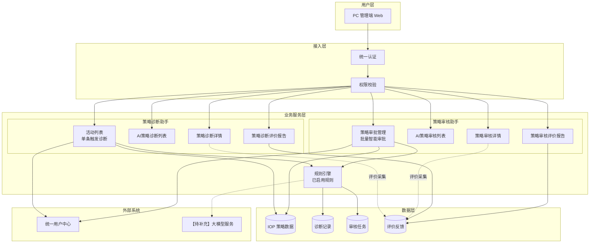
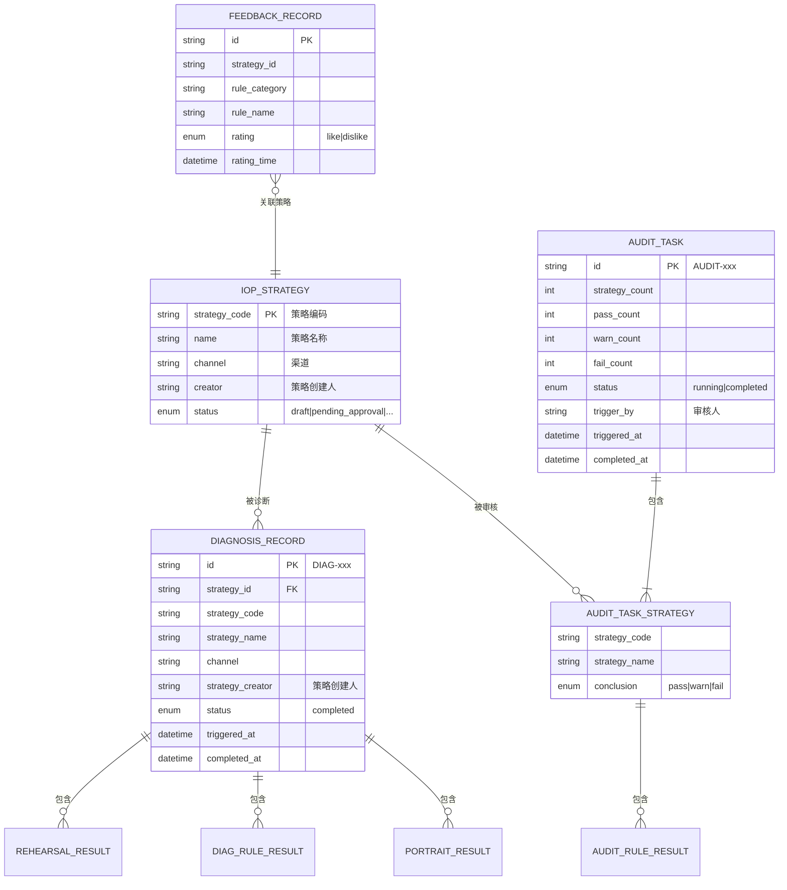
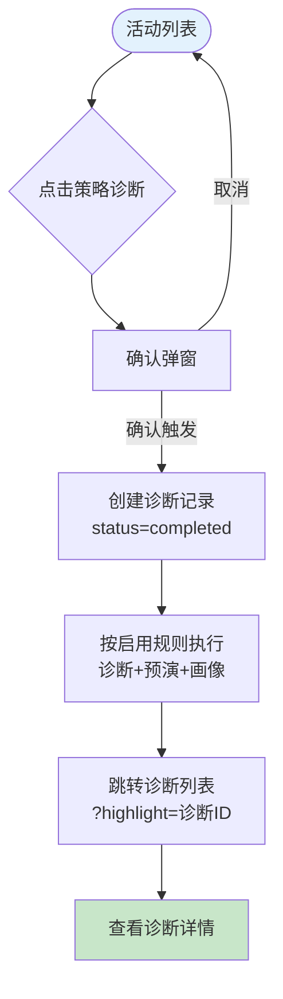
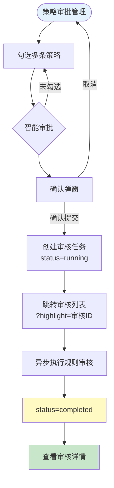
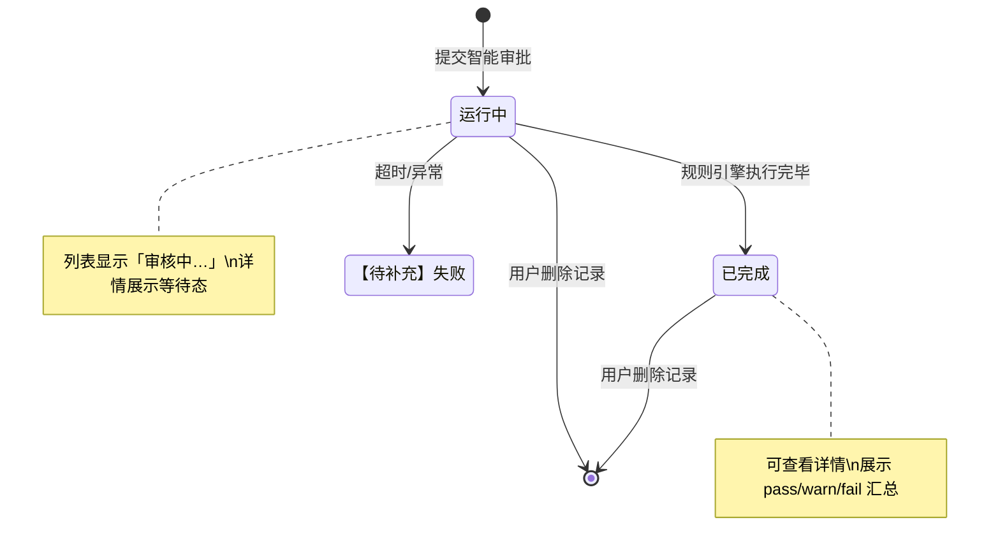

# 策略诊断与审核助手 PRD

| PRD 审核人 | 【待补充】 |
| --- | --- |
| 重要性 | 高 |
| 紧迫性 | 中 |
| 需求方 | 基础功能 / 智能体管理 |
| PRD 编写人 | 【待补充】 |
| PRD 提交日期 | 2026-07-06 |
| 需求级别 | **L3（模块级）** |
| 产品定型 | **企业自研系统 × 业务管理型（含 AI 辅助决策能力）** |

## PRD 修改记录

| 变更时间 | 变更内容 | 变更提出部门与理由 | 修改人 | 审核人 | 版本号 |
| --- | --- | --- | --- | --- | --- |
| 2026-07-07 | 策略审核评价管理：去掉批量标记/删除/勾选，补充单条导出/删除/标记；新增策略诊断/审核规则分类管理 PRD | 评价与规则配置需求补充 | 【待补充】 | 【待补充】 | v2.2 |
| 2026-07-07 | 策略诊断评价管理：去掉批量标记/删除/勾选；补充单条导出、删除、标记已处理/取消标记 | 评价处理交互优化 | 【待补充】 | 【待补充】 | v2.1 |
| 2026-07-06 | 按 create-prd L3 + prd-module-doc 规范重写；活动列表移除批量审批/审核入口/勾选框；诊断列表「触发人」改为「策略创建人」 | 智能体管理子模块需求沉淀 | 【待补充】 | 【待补充】 | v2.0 |
| 2026-07-06 | 初版：策略诊断助手、策略审核助手业务 PRD | 智能体管理子模块需求沉淀 | 【待补充】 | 【待补充】 | v1.0 |

---

## 1、项目背景

> 💡 方法论提示：《决胜B端》三层业务调研框架（战略层→战术层→执行层）

### 1.1 业务现状

移动市场运营平台已接入 IOP 策略数据，运营人员在策略上线前需对策略配置进行合规性、可执行性检查；审批环节同样依赖人工经验，标准不统一、批量处理效率低。

平台在「基础功能 → 智能体管理」下建设两类 AI 助手：

1. **策略诊断助手**：从活动列表选取单条策略，按已启用的诊断规则、预演规则、客群画像规则输出诊断结论，辅助运营人员发现配置风险。
2. **策略审核助手**：在策略审批管理页勾选多条待审策略，批量发起 AI 智能审批，按审核规则输出逐策略、逐规则的审核结论，辅助审批人员决策。

演示环境已实现核心列表、详情、触发与评价报告能力。**规则配置、评价明细维护等能力由独立 PRD 覆盖，本 PRD 不展开。**

### 1.2 面临问题

1. **诊断入口分散**：运营人员缺少统一入口浏览 IOP 策略并一键发起诊断。
2. **诊断结果难追溯**：缺少诊断任务列表与结构化详情，无法复盘历史结论。
3. **审批效率低**：批量策略审批缺乏 AI 辅助，人工逐条核对耗时长。
4. **效果难量化**：缺少对助手使用频次与用户满意度的汇总视图（评价报告）。

### 1.3 解决思路

| 助手 | 业务闭环 |
| --- | --- |
| 策略诊断助手 | 活动列表选策略 → 触发诊断 → 诊断列表查记录 → 详情看预演/规则/画像 → 评价报告看满意度 |
| 策略审核助手 | 策略审批管理选策略 → 智能审批 → 审核列表查任务 → 详情看逐策略结论 → 评价报告看满意度 |

### 1.4 决策依据

| 依据 | 说明 |
| --- | --- |
| 业务诉求 | 提升策略配置质量与审批效率，降低合规风险 |
| 平台定位 | 与 IOP 策略数据、策略中心生命周期衔接 |
| 演示验证 | 演示版已覆盖活动列表、诊断/审核列表与详情、审批管理、评价报告弹窗 |
| 边界说明 | 规则引擎配置、评价明细 CRUD 不在本 PRD 范围 |

---

## 2、需求基本情况

> 💡 方法论提示：《决胜B端》需求发现十三要素五步法 — 分析角色 + 了解基本场景

| 要素 | 内容 |
| --- | --- |
| **需求提出人** | 【待补充】（预计：省公司运营管理部门 / 数字化产品负责人） |
| **功能使用人** | 省公司/地市运营人员、策略审批人员、产品/运营管理员 |
| **受影响人** | 策略创建人、审批流程参与人 |
| **场景描述** | 见下方核心场景 |
| **发生频率** | 诊断：日级；批量审批：周级；【待补充：正式频次】 |
| **核心痛点** | 人工核对慢、结论不可追溯、批量审批难、效果难量化 |
| **需求价值** | 缩短策略自检与审批周期，沉淀可查询的 AI 结论与满意度数据 |

### 核心场景

**场景1：运营人员对单条策略发起诊断**

- **人物**：省公司运营人员（张明）
- **地点**：PC · 活动列表
- **经过**：按 Tab/条件筛选策略 → 点击行内「策略诊断」→ 确认触发 → 跳转 AI 策略诊断列表并高亮新记录
- **结果**：在诊断详情查看预演结果、诊断规则结论、客群画像分析

**场景2：审批人员批量智能审批**

- **人物**：策略审批人员
- **地点**：PC · 策略审批管理
- **经过**：勾选多条待审策略 →「智能审批」→ 确认提交 → 跳转 AI 策略审核列表
- **结果**：审核完成后查看每条策略的审核结论与规则明细

**场景3：管理人员查看评价报告**

- **人物**：产品/运营管理员
- **地点**：PC · 策略诊断/审核评价管理页 · 评价报告弹窗
- **经过**：选择统计周期 → 查看评价汇总、分类满意度、功能使用数据
- **结果**：识别低满意度规则分类，驱动规则优化（规则配置另文）

---

## 4、项目收益目标

> 💡 方法论提示：SMART 原则（企业自研侧重效率与采纳）

### 4.1 项目目标

| 目标类型 | 目标描述 | 衡量指标 | 目标值 | 达成时限 |
| --- | --- | --- | --- | --- |
| 效率目标 | 缩短单策略诊断与批量审批耗时 | 平均处理时长 | 【待补充】 | 上线后 3 个月 |
| 质量目标 | 提升策略问题发现率 | 诊断/审核「疑似存在问题」命中率复核一致率 | 【待补充】 | 上线后 3 个月 |
| 采纳目标 | 助手功能被业务使用 | 月活跃用户数、任务数 | 【待补充】 | 上线后 1 个月 |

### 4.2 验收标准

**策略诊断助手**

1. 活动列表支持多维度筛选与 Tab 切换，可对单条策略触发 AI 诊断；**不含**批量审批、审核列表入口、行勾选框。
2. AI 策略诊断列表支持关键词查询、分页、删除、跳转详情；列表展示**策略创建人**（非触发人）。
3. 诊断详情完整展示策略预演结果、诊断规则结果、客群画像分析（只读）。
4. 策略诊断评价管理支持评价列表查询、导出、单条删除、单条标记已处理/取消标记（不含批量操作）；评价报告支持按周期统计。
5. 策略诊断规则分类管理支持分类增删改查与启用/停用，供诊断规则配置引用。

**策略审核助手**

1. 策略审批管理支持策略筛选、多选、智能审批提交；页头提供「智能审核任务」跳转。
2. AI 策略审核列表展示任务进度、通过数、疑似问题数，支持查看详情与删除。
3. 审核详情按策略分块展示综合结论与规则明细表（只读）。
4. 策略审核评价管理支持评价列表查询、导出、单条删除、单条标记已处理/取消标记（不含批量操作）；评价报告支持按周期统计。
5. 策略审核规则分类管理支持分类增删改查与启用/停用，供审核规则配置引用。

### 4.3 不在本期范围内

| 编号 | 内容 | 说明 |
| --- | --- | --- |
| O1 | 策略诊断规则管理（诊断/预演/画像规则） | 独立配置 PRD |
| O2 | 策略审核规则管理 | 独立配置 PRD |
| O3 | 活动列表批量 AI 智能审批 | 仅在策略审批管理发起 |
| O4 | IOP 策略数据实时同步策略 | 【待补充】对接方案 |
| O5 | 大模型 Prompt 与训练 | 本期以规则引擎 + 【待补充】模型增强为边界 |

---

## 5、项目方案概述

### 5.1 功能清单（本期）

#### 策略诊断助手管理

| 子模块 | 页面/能力 | PC 端 | 说明 |
| --- | --- | --- | --- |
| 活动列表 | 策略列表 + 筛选 + Tab | ✓ | 接入 IOP 策略，单条触发诊断 |
| 活动列表 | 触发策略诊断弹窗 | ✓ | 确认后创建诊断任务 |
| 活动列表 | 页头「AI策略诊断列表」 | ✓ | **唯一**页头快捷入口 |
| AI策略诊断列表 | 诊断记录列表 | ✓ | 查询、删除、跳转详情 |
| 策略诊断详情 | 预演 / 规则 / 画像三块结果 | ✓ | 只读 |
| 策略诊断评价管理 | 评价列表 + 单条维护 + 报告 | ✓ | 导出/删除/标记，无批量 |
| 策略诊断规则分类管理 | 分类 CRUD + 启停 | ✓ | 供诊断规则引用 |

#### 策略审核助手管理

| 子模块 | 页面/能力 | PC 端 | 说明 |
| --- | --- | --- | --- |
| 策略审批管理 | 策略列表 + 多选 | ✓ | 批量发起智能审批 |
| 策略审批管理 | 智能审批确认弹窗 | ✓ | 预览已选策略 |
| 策略审批管理 | 跳转智能审核任务 | ✓ | 进入审核列表 |
| AI策略审核列表 | 审核任务列表 | ✓ | 运行中/已完成、删除 |
| 策略审核详情 | 逐策略审核结论 + 规则表 | ✓ | 只读 |
| 策略审核评价管理 | 评价列表 + 单条维护 + 报告 | ✓ | 导出/删除/标记，无批量 |
| 策略审核规则分类管理 | 分类 CRUD + 启停 | ✓ | 供审核规则引用 |

### 5.2 菜单与页面对照

| 一级菜单（nav-data.js） | 二级页面 | 页面文件 |
| --- | --- | --- |
| 策略诊断助手管理 | 活动列表 | `pages/agent-activity-list.html` |
| 策略诊断助手管理 | AI策略诊断列表 | `pages/agent-diagnosis-list.html` |
| 策略诊断助手管理 | 策略诊断详情 | `pages/agent-diagnosis-detail.html` |
| 策略诊断助手管理 | 策略诊断评价管理 | `pages/agent-diagnosis-feedback.html` |
| 策略诊断助手管理 | 策略诊断规则分类管理 | `pages/agent-diagnosis-rule-category.html` |
| 策略审核助手管理 | 策略审批管理 | `pages/agent-strategy-approval.html` |
| 策略审核助手管理 | AI策略审核列表 | `pages/agent-audit-list.html` |
| 策略审核助手管理 | 策略审核详情 | `pages/agent-audit-detail.html` |
| 策略审核助手管理 | 策略审核评价管理 | `pages/agent-audit-feedback.html` |
| 策略审核助手管理 | 策略审核规则分类管理 | `pages/agent-audit-rule-category.html` |

---

## 6、项目范围

### 6.1 涉及系统

| 系统名称 | 关系类型 | 影响描述 |
| --- | --- | --- |
| 移动市场运营平台 | 主体 | 诊断/审核助手页面与交互 |
| IOP 策略中心 | 数据来源 | 活动/策略主数据 |
| 智能体规则服务 | 能力依赖 | 读取已启用诊断/审核规则执行分析 |
| 统一用户中心 | 数据来源 | 当前用户、策略创建人 |
| 【待补充】大模型服务 | 能力依赖 | 规则结论生成增强 |

### 6.2 影响范围

- **用户影响**：运营与审批人员使用新菜单完成诊断与审批辅助；管理员查看评价报告。
- **流程影响**：策略自检、审批前增加 AI 辅助环节；**不替代**正式审批流。
- **数据影响**：新增诊断记录、审核任务实体；评价报告读取既有评价反馈数据。

---

## 10、功能需求

> 💡 方法论提示：《决胜B端》自顶向下设计 — 框架图 → 数据模型 → 流程 → 页面 → 权限 → 字段

### 10.1 产品框架概述

#### 10.1.1 应用架构图

#### 10.1.2 数据模型图

> 💡 ER 建模三步法：找实体 → 梳关系 → 定属性

**实体说明补充**

| 实体 | 关键属性说明 | 数据来源 |
| --- | --- | --- |
| IOP_STRATEGY | 活动/策略主数据 | IOP 策略中心 |
| DIAGNOSIS_RECORD | 单次诊断任务及结论快照 | 系统生成 + 规则引擎 |
| AUDIT_TASK | 批量审核任务及汇总计数 | 系统生成 + 规则引擎 |
| REHEARSAL_RESULT / PORTRAIT_RESULT | 预演与画像明细 | 规则引擎 |
| DIAG_RULE_RESULT / AUDIT_RULE_RESULT | 逐规则结论 | 规则引擎 |
| FEEDBACK_RECORD | 用户对规则结论的点赞/点踩 | 【待补充】详情页采集；报告只读 |

#### 10.1.3 核心业务流程

**流程A：策略诊断**

**流程B：策略智能审批**

#### 10.1.4 状态机图

**审核任务状态（AUDIT_TASK.status）**

| 当前状态 | 触发事件 | 目标状态 | 操作角色 | 备注 |
| --- | --- | --- | --- | --- |
| — | 确认提交智能审批 | 运行中 | 审批人员 | 演示约 2.5s 自动完成 |
| 运行中 | 异步执行完成 | 已完成 | 系统 | 正式环境【待补充】轮询/推送 |
| 运行中/已完成 | 删除记录 | — | 运营/审批/管理员 | 二次确认，物理删除 |

**诊断记录状态**：演示环境触发后同步返回，固定为「已完成」；正式环境异步方案【待补充】。

---

### 10.2 产品需求详解

> 层级规范：**一级模块 → 二级页面 → 三级功能块 → 功能项**（与 `nav-data.js` 及页面 HTML 一致）

---

#### 10.2.1 策略诊断助手管理

##### 10.2.1.1 活动列表

**页面文件**：`pages/agent-activity-list.html`  
**菜单路径**：基础功能 → 策略诊断助手管理 → 活动列表

###### 10.2.1.1.1 页面说明区

**功能1：页面说明展示**

- 标题：策略智能诊断 · 活动列表
- 说明文案：接入 IOP 策略数据，支持对单条策略发起 AI 智能诊断，诊断结果可在 AI 策略诊断列表中查看
- 数据来源：【待补充】（静态配置文案）

###### 10.2.1.1.2 页头操作区

**功能1：快捷导航**

| 按钮名称 | 操作说明 | 跳转目标 | 备注 |
| --- | --- | --- | --- |
| AI策略诊断列表 | 进入诊断记录列表 | `agent-diagnosis-list.html` | **唯一**页头快捷入口 |

> **本期明确不包含**：批量提交 AI 智能审批、「智能审核任务」/ AI 策略审核列表入口、行级多选框。

###### 10.2.1.1.3 活动范围 Tab

**功能1：Tab 切换筛选**

| Tab 名称 | 筛选逻辑 | 数据来源 |
| --- | --- | --- |
| 全部活动 | 不过滤创建人 | 用户录入（Tab 选择） |
| 我的活动 | creator = 当前登录用户 | 用户录入 + 登录用户 + IOP策略数据 |
| 全部策略 | 同全部活动 | 用户录入 |
| 我的策略 | creator = 当前登录用户 | 用户录入 + 登录用户 + IOP策略数据 |
| 优秀策略 | status ∈ {completed, executing} | 用户录入 + IOP策略数据 |

- 切换 Tab 后重置分页为第 1 页，重新渲染列表。

###### 10.2.1.1.4 查询区

**功能1：多条件查询**

| 字段名称 | 默认值 | 字段类型 | 数据来源 | 匹配规则 |
| --- | --- | --- | --- | --- |
| 策略ID | 空 | 文本 | 用户录入 | 模糊匹配 strategyCode |
| 策略名称 | 空 | 文本 | 用户录入 | 模糊匹配 name |
| 创建时间 | 空 | 日期区间 | 用户录入 | 起止日期过滤 createdAt |
| 策略状态 | 全部 | 下拉 | 用户录入 | 精确匹配；枚举见下表 |
| 业务线条 | 全部 | 下拉 | 用户录入 | 精确匹配 groupScene |
| 渠道名称 | 空 | 文本 | 用户录入 | 模糊匹配 channelLabel |
| 运营位名称 | 空 | 文本 | 用户录入 | 模糊匹配 operationPosition |
| 产品名称 | 空 | 文本 | 用户录入 | 模糊匹配 productInfo |
| 产品编码 | 空 | 文本 | 用户录入 | 模糊匹配 productCode |
| 业务类型 | 全部 | 下拉 | 用户录入 | 精确匹配 activityType |

**策略状态下拉枚举**（数据来源：IOP策略数据 / 【待补充】字典）：草稿、审批中、待执行、执行中、完成、终止。

**业务线条枚举**：公众市场、政企市场。  
**业务类型枚举**：精准营销、关怀营销、促销营销。

**功能2：重置**

- 清空所有查询字段为默认值，分页重置为第 1 页。

###### 10.2.1.1.5 策略列表

**功能1：列表展示**

| 字段名称 | 数据来源 | 备注 |
| --- | --- | --- |
| 策略ID | IOP策略数据 | strategyCode；超长省略 |
| 策略名称 | IOP策略数据 | name |
| 渠道 | IOP策略数据 | channelLabel |
| 运营位 | IOP策略数据 / 关联计算 | 演示：由渠道推导默认值 |
| 产品信息 | IOP策略数据 | product |
| 客户群数量 | IOP策略数据 | scaleLabel |
| 业务类型 | IOP策略数据 | activityType |
| 业务线条 | IOP策略数据 | groupScene |
| 服务大类标签 | IOP策略数据 | operationScene / type |

- 分页：每页 10 条（数据来源：系统生成）
- 排序：默认按 IOP 策略列表原始顺序；【待补充】正式默认排序规则
- 列表统计：卡片头展示「共 N 条」（数据来源：关联计算）
- **不含**行勾选框、批量操作列

**功能2：行级操作 — 策略诊断**

- 点击后打开「触发策略诊断」确认弹窗。
- 约束：单次仅可对一条策略触发诊断。

###### 10.2.1.1.6 触发策略诊断弹窗

**功能1：确认触发**

| 元素 | 说明 | 数据来源 |
| --- | --- | --- |
| 提示文案 | 确认对该策略发起 AI 智能诊断；依据已启用的诊断规则、预演规则与客群画像规则分析 | 【待补充】 |
| 预览-策略名称 | 当前行策略名称 | IOP策略数据 |
| 预览-策略ID | 当前行策略编码 | IOP策略数据 |
| 预览-渠道 | 当前行渠道 | IOP策略数据 |
| 确认触发 | 创建诊断记录，跳转 `agent-diagnosis-list.html?highlight={诊断ID}` | 系统生成 + 规则引擎 |
| 取消 | 关闭弹窗，不创建记录 | — |

**业务规则**

| 编号 | 规则类型 | 规则描述 |
| --- | --- | --- |
| SD-R1 | 事实 | 列表数据来源于 IOP 策略中心 |
| SD-R2 | 约束 | 单次仅可对一条策略触发诊断；活动列表无批量诊断 |
| SD-R3 | 触发条件 | 确认触发后立即生成诊断记录，演示环境状态为「已完成」（同步返回） |
| SD-R4 | 推论 | 诊断记录写入 `strategyCreator`（取自 IOP 策略 creator），供诊断列表展示 |

---

##### 10.2.1.2 AI策略诊断列表

**页面文件**：`pages/agent-diagnosis-list.html`  
**菜单路径**：基础功能 → 策略诊断助手管理 → AI策略诊断列表

###### 10.2.1.2.1 页头操作区

**功能1：返回导航**

| 按钮 | 跳转目标 |
| --- | --- |
| 返回活动列表 | `agent-activity-list.html` |

###### 10.2.1.2.2 查询区

**功能1：关键词查询**

| 字段名称 | 字段类型 | 数据来源 | 匹配范围 |
| --- | --- | --- | --- |
| 策略ID / 名称 | 文本 | 用户录入 | 诊断ID、strategyCode、strategyName 模糊匹配 |

###### 10.2.1.2.3 诊断记录列表

**功能1：列表展示**

| 字段名称 | 数据来源 | 备注 |
| --- | --- | --- |
| 诊断ID | 系统生成 | 格式 DIAG-xxx |
| 策略ID | IOP策略数据 | 触发时快照 strategyCode |
| 策略名称 | IOP策略数据 | 触发时快照 strategyName |
| 渠道 | IOP策略数据 | 触发时快照 channel |
| 策略创建人 | IOP策略数据 | 取自 strategyCreator；优先诊断记录，其次活动数据 creator；**非触发操作人** |
| 诊断时间 | 系统生成 | completedAt，无则 triggeredAt |
| 状态 | 系统生成 | 演示固定「已完成」 |

- 分页：每页 10 条
- 排序：默认按诊断时间倒序
- 空状态：「暂无诊断记录，请从活动列表触发策略诊断」

**功能2：高亮新记录**

- URL 参数 `highlight={诊断ID}` 时，对应行背景高亮（数据来源：用户录入 URL 参数 + 系统生成记录）

**功能3：行级操作**

| 操作 | 说明 | 状态/权限 |
| --- | --- | --- |
| 查看详情 | 跳转 `agent-diagnosis-detail.html?id={诊断ID}` | 任意记录 |
| 删除 | 二次确认后物理删除 | 不可恢复（本期） |

**业务规则**

| 编号 | 规则类型 | 规则描述 |
| --- | --- | --- |
| SD-R5 | 事实 | 列表默认按诊断时间倒序 |
| SD-R6 | 推论 | URL 参数 highlight 高亮对应诊断行 |
| SD-R7 | 约束 | 删除为物理删除，不可恢复 |

---

##### 10.2.1.3 策略诊断详情

**页面文件**：`pages/agent-diagnosis-detail.html`  
**菜单路径**：由诊断列表进入（非独立侧栏菜单）

###### 10.2.1.3.1 头部信息区

**功能1：策略与诊断概要展示**

| 字段名称 | 数据来源 | 备注 |
| --- | --- | --- |
| 策略ID | 系统生成（诊断记录快照） | strategyCode |
| 策略名称 | 系统生成（诊断记录快照） | strategyName |
| 渠道 | 系统生成（诊断记录快照） | channel |
| 诊断时间 | 系统生成 | completedAt |

- 记录不存在时展示「未找到诊断记录」。

###### 10.2.1.3.2 策略预演结果

**功能1：预演规则结果表**

| 字段名称 | 数据来源 | 备注 |
| --- | --- | --- |
| 序号 | 关联计算 | 预演规则序号 |
| 预演规则 | 规则引擎 | 已启用预演规则名称 |
| 预演概况-初始客群 | 规则引擎 / 关联计算 | 基于策略 scaleNum 计算 |
| 预演概况-预演后 | 规则引擎 / 关联计算 | 过滤后剩余客群 |
| 过滤明细-序号 | 关联计算 | 子表 |
| 过滤明细-过滤规则 | 规则引擎 | 如接触频次过滤、产品互斥过滤等 |
| 过滤明细-过滤客户数 | 规则引擎 / 关联计算 | |
| 过滤明细-剩余客户数 | 规则引擎 / 关联计算 | |

- 无预演结果时展示「暂无预演结果」。

###### 10.2.1.3.3 诊断规则结果

**功能1：诊断规则结论表**

| 字段名称 | 数据来源 | 备注 |
| --- | --- | --- |
| 序号 | 关联计算 | |
| 规则名称 | 规则引擎 | 已启用诊断规则 |
| 校验字段 | 规则引擎 | 如投放周期、客群规模等 |
| 诊断结论 | 规则引擎 | 「诊断完成」/「可能存在问题」 |
| 诊断分析 | 规则引擎 | 文字说明 |

- 结论「可能存在问题」对应 warn 态，其余为 ok。
- 详情页只读，不支持编辑结论。

###### 10.2.1.3.4 客群画像分析

**功能1：画像规则结果表**

| 字段名称 | 数据来源 | 备注 |
| --- | --- | --- |
| 序号 | 关联计算 | |
| 规则名称 | 规则引擎 | 已启用画像规则 |
| 分析维度 | 规则引擎 | 维度标签名称汇总，如「12-年龄、88-ARPU档位」 |
| 画像分析结果-取值 | 规则引擎 | 各维度枚举取值 |
| 画像分析结果-占比 | 规则引擎 / 关联计算 | ratioLabel |
| 画像分析结果-客群人数 | 规则引擎 / 关联计算 | 基于策略规模计算 |

- 无画像结果时展示「暂无画像分析结果」。

**业务规则**

| 编号 | 规则类型 | 规则描述 |
| --- | --- | --- |
| SD-R8 | 事实 | 仅展示已启用规则产生的结论项 |
| SD-R9 | 推论 | 结论 warn 对应「可能存在问题」，ok 对应「诊断完成」 |
| SD-R10 | 约束 | 详情页只读 |

---

##### 10.2.1.4 策略诊断评价管理

**页面文件**：`pages/agent-diagnosis-feedback.html`  
**菜单路径**：基础功能 → 策略诊断助手管理 → 策略诊断评价管理

> **范围说明**：含评价列表维护（导出、单条删除、单条点踩处理）与评价报告；**不含**批量勾选、批量标记、批量删除。

###### 10.2.1.4.1 页面说明区

**功能1：页面说明展示**

- 标题：策略诊断助手 · 评价管理
- 说明：查看业务人员对诊断规则结论的点赞、点踩反馈，支持导出、单条点踩处理闭环与评价报告
- 数据来源：【待补充】

###### 10.2.1.4.2 评价列表查询

**功能1：筛选查询**

| 字段名称 | 默认值 | 字段类型 | 数据来源 | 备注 |
| --- | --- | --- | --- | --- |
| 评价开始 | 2025-12-01 | 日期 | 用户录入 | ratingTime 下限 |
| 评价结束 | 2025-12-31 | 日期 | 用户录入 | ratingTime 上限 |
| 评价结果 | 全部 | 下拉 | 用户选择 | 全部/点赞/点踩 |
| 关键词 | 空 | 文本 | 用户录入 | 策略ID、规则名称等模糊匹配 |

**功能2：列表展示**

| 字段名称 | 字段类型 | 数据来源 | 备注 |
| --- | --- | --- | --- |
| 序号 | 数字 | 关联计算 | 当前页序号 |
| 策略ID | 文本 | 评价记录 strategyId | |
| 规则分类 | 文本 | 评价记录 ruleCategory | |
| 规则名称 | 文本 | 评价记录 ruleName | |
| 校验字段 | 文本 | 评价记录 checkField | |
| 评价人 | 文本 | 评价记录 evaluator | |
| 评价结果 | 枚举 | 评价记录 rating | 点赞；点踩（已处理时展示「已处理」徽章） |
| 评价时间 | 日期时间 | 评价记录 ratingTime | |

> **不含**行勾选框、全选当前页。

**功能3：列表工具栏**

| 按钮名称 | 操作说明 | 触发条件 | 备注 |
| --- | --- | --- | --- |
| 导出 | 将当前筛选结果导出 CSV | 任意 | 文件名：`策略诊断评价_yyyy-mm-dd.csv` |
| 评价报告 | 打开评价报告弹窗 | 任意 | 见 10.2.1.4.4 |

> **不含**「标记处理结果」「删除」批量按钮。

**功能4：行级操作**

| 操作 | 显示条件 | 说明 |
| --- | --- | --- |
| 详情 | 任意 | 打开评价详情弹窗（只读） |
| 标记已处理 | rating = 点踩 且 processed = false | 写入 processed=true、processedBy、processedAt |
| 取消标记 | rating = 点踩 且 processed = true | 二次确认后清除 processed 状态 |
| 删除 | 任意 | 二次确认后物理删除该条评价记录 |

**功能5：导出 CSV 字段**

| 列名 | 数据来源 |
| --- | --- |
| 策略ID | strategyId |
| 规则分类 | ruleCategory |
| 规则名称 | ruleName |
| 校验字段 | checkField |
| 评价人 | evaluator |
| 评价结果 | 点赞/点踩 |
| 处理状态 | 点踩时：已处理/待处理；点赞时：— |
| 评价时间 | ratingTime |
| 点踩原因 | comment（点赞为空） |

**业务规则**

| 编号 | 规则类型 | 规则描述 |
| --- | --- | --- |
| SD-R11 | 约束 | 仅点踩评价可标记/取消标记；点赞无处理状态 |
| SD-R12 | 约束 | 不支持批量勾选与批量标记、批量删除 |
| SD-R13 | 事实 | 标记已处理时 processedBy 记为当前登录用户（演示：超级管理员） |
| SD-R14 | 约束 | 取消标记需二次确认，清除 processed、processedAt、processedBy |
| SD-R15 | 约束 | 删除为物理删除，不可恢复 |

###### 10.2.1.4.3 评价详情弹窗

**功能1：只读详情展示**

| 字段名称 | 数据来源 |
| --- | --- |
| 策略ID | 评价记录 |
| 规则分类 | 评价记录 |
| 规则名称 | 评价记录 |
| 校验字段 | 评价记录 |
| 评价人 | 评价记录 |
| 评价结果 | 评价记录 |
| 评价时间 | 评价记录 |
| 点踩原因 | comment（仅点踩展示） |
| 处理状态 | 已处理（处理人·时间）/ 待处理（仅点踩展示） |

###### 10.2.1.4.4 评价报告弹窗

**功能1：统计周期选择**

| 字段名称 | 默认值 | 字段类型 | 数据来源 |
| --- | --- | --- | --- |
| 开始日期 | 2025-12-01 | 日期 | 用户录入 |
| 结束日期 | 2025-12-31 | 日期 | 用户录入 |
| 刷新统计 | 按钮 | — | 触发关联计算 |

**功能2：评价情况汇总**

| 指标名称 | 计算说明 | 数据来源 |
| --- | --- | --- |
| 评价总数 | 区间内评价记录数 | 关联计算 |
| 点赞 | rating = like 的数量 | 关联计算 |
| 点踩 | rating = dislike 的数量 | 关联计算 |
| 点踩待处理 | 点踩且 processed = false 的数量 | 关联计算 |

**功能3：按规则分类满意度**

| 字段名称 | 数据来源 | 备注 |
| --- | --- | --- |
| 规则分类 | 【待补充】评价记录 | 如策略基本信息、策略客群信息等 |
| 点赞 | 关联计算 | 该分类点赞数 |
| 点踩 | 关联计算 | 该分类点踩数 |
| 满意度 | 关联计算 | 点赞占比进度条 |

**功能4：功能使用数据**

| 指标名称 | 计算说明 | 数据来源 |
| --- | --- | --- |
| 诊断任务数 | 区间内诊断记录数（按 triggeredAt） | 关联计算 |
| 涉及策略数 | 诊断涉及策略累计（strategyCount 或 1） | 关联计算 |
| 评价人次 | 区间内评价记录数 | 关联计算 |
| 评价覆盖率 | min(100, 评价数 / 涉及策略数 × 100%) | 关联计算 |

**业务规则**

| 编号 | 规则类型 | 规则描述 |
| --- | --- | --- |
| SD-R16 | 约束 | 评价统计按 ratingTime 落在所选区间内 |
| SD-R17 | 推论 | 评价数据来源于用户对诊断规则结论的点赞/点踩；【待补充】正式采集埋点 |
| SD-R18 | 约束 | 报告只读，不支持在报告内修改评价 |

---

##### 10.2.1.5 策略诊断规则分类管理

**页面文件**：`pages/agent-diagnosis-rule-category.html`  
**菜单路径**：基础功能 → 策略诊断助手管理 → 策略诊断规则分类管理

> 分类用于「策略诊断规则管理」中配置规则的归属分组；**页面不展示编码字段**，保存时系统自动生成或保留内部 `code`。

###### 10.2.1.5.1 页面说明区

**功能1：页面说明展示**

- 说明：对策略诊断规则进行分类管理，分类可用于「策略诊断规则管理」中配置规则归属
- 数据来源：【待补充】

###### 10.2.1.5.2 分类列表

**功能1：筛选查询**

| 字段名称 | 默认值 | 字段类型 | 数据来源 | 备注 |
| --- | --- | --- | --- | --- |
| 分类名称 | 空 | 文本 | 用户录入 | 模糊匹配 name |
| 状态 | 全部状态 | 下拉 | 用户选择 | 全部/启用/停用 |

**功能2：列表展示**

| 字段名称 | 字段类型 | 数据来源 | 备注 |
| --- | --- | --- | --- |
| 分类ID | 文本 | 系统生成 | 格式 RC-xxx |
| 分类名称 | 文本 | 用户录入 | |
| 描述 | 文本 | 用户录入 | 超长省略 |
| 状态 | 枚举 | 用户操作 | 启用/停用 |
| 更新人 | 文本 | 登录用户 | 保存时写入 |
| 更新时间 | 日期时间 | 系统生成 | 保存时写入 |

**功能3：页头与行级操作**

| 操作 | 说明 | 状态规则 |
| --- | --- | --- |
| 新增分类 | 打开空表单弹窗 | — |
| 编辑 | 打开编辑表单 | — |
| 启用 | 仅停用态显示 | status: disabled → enabled |
| 停用 | 仅启用态显示 | status: enabled → disabled |
| 删除 | 二次确认后删除 | 物理删除 |

###### 10.2.1.5.3 新增/编辑分类弹窗

| 字段名称 | 必填 | 字段类型 | 数据来源 | 备注 |
| --- | --- | --- | --- | --- |
| 分类名称 | 是 | 文本 | 用户录入 | |
| 描述 | 否 | 多行文本 | 用户录入 | |

**业务规则**

| 编号 | 规则类型 | 规则描述 |
| --- | --- | --- |
| SD-R19 | 事实 | 新增分类默认 status = enabled |
| SD-R20 | 推论 | 内部 code 由分类名称 slug 自动生成；编辑时保留原 code |
| SD-R21 | 约束 | 分类名称不可为空 |
| SD-R22 | 推论 | 停用分类后，【待补充】是否允许新建规则引用该分类 |
| SD-R23 | 约束 | 删除为物理删除；【待补充】已有关联规则时的删除约束 |

**预置分类示例（演示）**

| 分类ID | 分类名称 | 描述 |
| --- | --- | --- |
| RC-001 | 基础合规 | 策略基础信息合规性检查 |
| RC-002 | 客群质量 | 客群规模、标签与规则合理性 |
| RC-003 | 渠道投放 | 渠道与运营位配置诊断 |
| RC-004 | 产品匹配 | 产品与客群匹配度、产品互斥关系诊断 |
| RC-005 | 外呼管控 | 外呼渠道、区域外呼与独立排呼诊断 |

---

#### 10.2.2 策略审核助手管理

##### 10.2.2.1 策略审批管理

**页面文件**：`pages/agent-strategy-approval.html`  
**菜单路径**：基础功能 → 策略审核助手管理 → 策略审批管理

###### 10.2.2.1.1 页面说明区

**功能1：页面说明展示**

- 标题：策略审核助手 · 策略审批管理
- 说明：浏览待审策略，勾选多条发起 AI 智能审批；可进入智能审核任务列表
- 数据来源：【待补充】

###### 10.2.2.1.2 页头操作区

**功能1：批量审批与任务导航**

| 按钮名称 | 操作说明 | 触发条件 | 数据来源 |
| --- | --- | --- | --- |
| 智能审批 | 打开确认弹窗 | 已选 ≥ 1 条策略；未选时 disabled | 用户录入（勾选） |
| 智能审核任务 | 跳转 AI 策略审核列表 | 任意 | — |

###### 10.2.2.1.3 查询区

**功能1：多条件查询**

| 字段名称 | 字段类型 | 数据来源 | 匹配规则 |
| --- | --- | --- | --- |
| 策略ID | 文本 | 用户录入 | 模糊 |
| 策略名称 | 文本 | 用户录入 | 模糊 |
| 策略状态 | 下拉 | 用户录入 | 精确；含审批退回 |
| 渠道名称 | 文本 | 用户录入 | 模糊 |
| 业务类型 | 下拉 | 用户录入 | 精确 |

**策略状态下拉枚举**：草稿、审批中、审批退回、待执行、执行中、完成、终止。

###### 10.2.2.1.4 策略列表（含多选）

**功能1：列表展示**

| 字段名称 | 数据来源 | 备注 |
| --- | --- | --- |
| 多选框 | 用户录入 | 支持全选当前页 |
| 策略ID | IOP策略数据 | strategyCode |
| 策略名称 | IOP策略数据 | name |
| 渠道 | IOP策略数据 | channelLabel |
| 策略状态 | IOP策略数据 | 徽章展示 |
| 业务类型 | IOP策略数据 | activityType |
| 业务线条 | IOP策略数据 | groupScene |
| 创建人 | IOP策略数据 | creator |
| 创建时间 | IOP策略数据 | createdAt，展示至分钟 |

- 分页：每页 10 条
- 卡片头辅助信息：「已选 N 条」（数据来源：关联计算）

**功能2：全选/反选当前页**

- 表头 checkbox 控制当前页所有行勾选状态；支持 indeterminate 半选态。

###### 10.2.2.1.5 智能审批确认弹窗

**功能1：确认提交**

| 元素 | 说明 | 数据来源 |
| --- | --- | --- |
| 提示文案 | 对所选策略发起 AI 智能审批；按「策略审核规则管理」启用规则逐条分析 | 【待补充】 |
| 预览-已选策略数 | N 条 | 关联计算 |
| 预览-策略列表 | 前 5 条「策略ID · 策略名称」 | IOP策略数据 |
| 确认提交 | 创建审核任务（running），清空勾选，跳转 `agent-audit-list.html?highlight={审核ID}` | 系统生成 + 规则引擎 |
| 取消 | 关闭弹窗 | — |

**业务规则**

| 编号 | 规则类型 | 规则描述 |
| --- | --- | --- |
| SA-R1 | 约束 | 未勾选策略时「智能审批」禁用 |
| SA-R2 | 事实 | 一次提交创建一条批量审核任务，包含多条策略 |
| SA-R3 | 推论 | 审核人（triggerBy）记为当前登录用户 |

---

##### 10.2.2.2 AI策略审核列表

**页面文件**：`pages/agent-audit-list.html`  
**菜单路径**：基础功能 → 策略审核助手管理 → AI策略审核列表

###### 10.2.2.2.1 页头操作区

**功能1：返回导航**

| 按钮 | 跳转目标 |
| --- | --- |
| 返回策略审批管理 | `agent-strategy-approval.html` |

###### 10.2.2.2.2 查询区

**功能1：关键词查询**

| 字段名称 | 数据来源 | 匹配范围 |
| --- | --- | --- |
| 审核ID / 策略名称 | 用户录入 | 审核ID、任务内策略名称模糊匹配 |

###### 10.2.2.2.3 审核任务列表

**功能1：列表展示**

| 字段名称 | 数据来源 | 备注 |
| --- | --- | --- |
| 审核ID | 系统生成 | AUDIT-xxx |
| 策略数 | 关联计算 | strategyCount |
| 通过 | 规则引擎 / 关联计算 | passCount；运行中为「—」 |
| 疑似存在问题 | 规则引擎 / 关联计算 | warnCount + failCount；运行中为「—」 |
| 任务状态 | 系统生成 | 运行中 / 已完成 |
| 审核人 | 登录用户 | triggerBy，提交智能审批的用户 |
| 审核时间 | 系统生成 | 未完成显示 triggeredAt，完成显示 completedAt |

- 分页：每页 10 条
- 空状态：「暂无审核记录，请从策略审批管理勾选策略发起 AI 智能审批」

**功能2：行级操作**

| 操作 | 可用状态 | 说明 |
| --- | --- | --- |
| 查看详情 | 已完成 | 跳转审核详情 |
| 审核中… | 运行中 | 不可点击 |
| 删除 | 任意 | 二次确认；运行中任务取消定时器后删除 |

**业务规则**

| 编号 | 规则类型 | 规则描述 |
| --- | --- | --- |
| SA-R4 | 触发条件 | 任务创建后 status=running，异步执行后变为 completed |
| SA-R5 | 推论 | 演示环境约 2.5s 自动完成；正式环境【待补充】 |
| SA-R6 | 推论 | highlight 参数高亮新创建任务行 |

---

##### 10.2.2.3 策略审核详情

**页面文件**：`pages/agent-audit-detail.html`  
**菜单路径**：由审核列表进入

###### 10.2.2.3.1 头部信息区（运行中）

**功能1：任务等待态展示**

| 字段名称 | 数据来源 |
| --- | --- |
| 审核ID | 系统生成 |
| 策略数量 | 关联计算 |
| 任务状态 | 系统生成 | 运行中徽章 |
| 审核人 | 登录用户 |
| 提交时间 | 系统生成 |

- 正文区展示等待文案：「智能体正在按启用规则逐条分析 N 条策略，请稍候…」
- 演示环境约 2.5s 后自动刷新为完成态。

###### 10.2.2.3.2 头部信息区（已完成）

**功能1：任务汇总展示**

| 字段名称 | 数据来源 |
| --- | --- |
| 审核ID | 系统生成 |
| 策略数量 | 关联计算 |
| 通过 / 疑似存在问题 | 关联计算 | passCount / (warnCount+failCount) |
| 审核人 | 登录用户 |
| 完成时间 | 系统生成 |

###### 10.2.2.3.3 策略结果分块

**功能1：逐策略结论块**

块头字段：

| 字段名称 | 数据来源 |
| --- | --- |
| 序号 | 关联计算 |
| 策略ID | IOP策略数据（快照） |
| 策略名称 | IOP策略数据（快照） |
| 渠道 | IOP策略数据（快照） |
| 审核结论 | 规则引擎 | 通过 / 疑似存在问题 |

块内规则明细表：

| 字段名称 | 数据来源 |
| --- | --- |
| 序号 | 关联计算 |
| 规则名称 | 规则引擎 |
| 审核字段 | 规则引擎 |
| 结论 | 规则引擎 | 通过 / 疑似存在问题 |
| 审核说明 | 规则引擎 | 文字分析 |

**业务规则**

| 编号 | 规则类型 | 规则描述 |
| --- | --- | --- |
| SA-R7 | 计算 | 单策略综合结论：存在 warn/fail 规则则为「疑似存在问题」，否则「通过」 |
| SA-R8 | 约束 | 详情页只读 |

---

##### 10.2.2.4 策略审核评价管理

**页面文件**：`pages/agent-audit-feedback.html`  
**菜单路径**：基础功能 → 策略审核助手管理 → 策略审核评价管理

> **范围说明**：含评价列表维护（导出、单条删除、单条点踩处理）与评价报告；**不含**批量勾选、批量标记、批量删除。

###### 10.2.2.4.1 页面说明区

**功能1：页面说明展示**

- 标题：策略审核助手 · 评价管理
- 说明：查看业务人员对审核规则结论的点赞、点踩反馈，支持导出、单条点踩处理闭环与评价报告
- 数据来源：【待补充】

###### 10.2.2.4.2 评价列表查询

**功能1：筛选查询**

| 字段名称 | 默认值 | 字段类型 | 数据来源 | 备注 |
| --- | --- | --- | --- | --- |
| 评价开始 | 2025-12-01 | 日期 | 用户录入 | ratingTime 下限 |
| 评价结束 | 2025-12-31 | 日期 | 用户录入 | ratingTime 上限 |
| 评价结果 | 全部 | 下拉 | 用户选择 | 全部/点赞/点踩 |
| 关键词 | 空 | 文本 | 用户录入 | 策略ID、规则名称等模糊匹配 |

**功能2：列表展示**

| 字段名称 | 字段类型 | 数据来源 | 备注 |
| --- | --- | --- | --- |
| 序号 | 数字 | 关联计算 | 当前页序号 |
| 策略ID | 文本 | 评价记录 strategyId | |
| 规则分类 | 文本 | 评价记录 ruleCategory | |
| 规则名称 | 文本 | 评价记录 ruleName | |
| 校验字段 | 文本 | 评价记录 checkField | |
| 评价人 | 文本 | 评价记录 evaluator | |
| 评价结果 | 枚举 | 评价记录 rating | 点赞；点踩（已处理时展示「已处理」徽章） |
| 评价时间 | 日期时间 | 评价记录 ratingTime | |

> **不含**行勾选框、全选当前页。

**功能3：列表工具栏**

| 按钮名称 | 操作说明 | 触发条件 | 备注 |
| --- | --- | --- | --- |
| 导出 | 将当前筛选结果导出 CSV | 任意 | 文件名：`策略审核评价_yyyy-mm-dd.csv` |
| 评价报告 | 打开评价报告弹窗 | 任意 | 见 10.2.2.4.4 |

**功能4：行级操作**

| 操作 | 显示条件 | 说明 |
| --- | --- | --- |
| 详情 | 任意 | 打开评价详情弹窗（只读） |
| 标记已处理 | rating = 点踩 且 processed = false | 写入 processed=true、processedBy、processedAt |
| 取消标记 | rating = 点踩 且 processed = true | 二次确认后清除 processed 状态 |
| 删除 | 任意 | 二次确认后物理删除该条评价记录 |

**功能5：导出 CSV 字段**

| 列名 | 数据来源 |
| --- | --- |
| 策略ID | strategyId |
| 规则分类 | ruleCategory |
| 规则名称 | ruleName |
| 校验字段 | checkField |
| 评价人 | evaluator |
| 评价结果 | 点赞/点踩 |
| 处理状态 | 点踩时：已处理/待处理；点赞时：— |
| 评价时间 | ratingTime |
| 点踩原因 | comment（点赞为空） |

**业务规则**

| 编号 | 规则类型 | 规则描述 |
| --- | --- | --- |
| SA-R9 | 约束 | 仅点踩评价可标记/取消标记；点赞无处理状态 |
| SA-R10 | 约束 | 不支持批量勾选与批量标记、批量删除 |
| SA-R11 | 事实 | 标记已处理时 processedBy 记为当前登录用户（演示：超级管理员） |
| SA-R12 | 约束 | 取消标记需二次确认，清除 processed、processedAt、processedBy |
| SA-R13 | 约束 | 删除为物理删除，不可恢复 |

###### 10.2.2.4.3 评价详情弹窗

与 10.2.1.4.3 结构一致，字段来源为审核评价记录。

###### 10.2.2.4.4 评价报告弹窗

**功能1：统计周期选择**

| 字段名称 | 默认值 | 数据来源 |
| --- | --- | --- |
| 开始日期 | 2025-12-01 | 用户录入 |
| 结束日期 | 2025-12-31 | 用户录入 |
| 刷新统计 | 按钮 | — |

**功能2：评价情况汇总**

| 指标名称 | 计算说明 | 数据来源 |
| --- | --- | --- |
| 评价总数 | 区间内评价记录数 | 关联计算 |
| 点赞 | rating = like 的数量 | 关联计算 |
| 点踩 | rating = dislike 的数量 | 关联计算 |
| 点踩待处理 | 点踩且 processed = false 的数量 | 关联计算 |

**功能3：按规则分类满意度**

| 字段名称 | 数据来源 | 备注 |
| --- | --- | --- |
| 规则分类 | 评价记录 ruleCategory | 如策略基本信息、策略客群信息等 |
| 点赞 | 关联计算 | |
| 点踩 | 关联计算 | |
| 满意度 | 关联计算 | 点赞占比进度条 |

**功能4：功能使用数据**

| 指标名称 | 计算说明 | 数据来源 |
| --- | --- | --- |
| 审核任务数 | 区间内审核任务数（按 triggeredAt/completedAt） | 关联计算 |
| 涉及策略数 | 审核涉及策略 strategyCount 累计 | 关联计算 |
| 评价人次 | 区间内评价记录数 | 关联计算 |
| 评价覆盖率 | min(100, 评价数 / 涉及策略数 × 100%) | 关联计算 |

**业务规则**

| 编号 | 规则类型 | 规则描述 |
| --- | --- | --- |
| SA-R14 | 约束 | 评价统计按 ratingTime 落在所选区间内 |
| SA-R15 | 推论 | 评价数据来源于用户对审核规则结论的点赞/点踩；【待补充】正式采集埋点 |
| SA-R16 | 约束 | 报告只读，不支持在报告内修改评价 |

---

##### 10.2.2.5 策略审核规则分类管理

**页面文件**：`pages/agent-audit-rule-category.html`  
**菜单路径**：基础功能 → 策略审核助手管理 → 策略审核规则分类管理

> 分类用于「策略审核规则管理」中配置规则的归属分组；**页面不展示编码字段**，保存时系统自动生成或保留内部 `code`。

###### 10.2.2.5.1 页面说明区

**功能1：页面说明展示**

- 说明：对策略审核规则进行分类管理，分类可用于「策略审核规则管理」中配置规则归属
- 数据来源：【待补充】

###### 10.2.2.5.2 分类列表

**功能1：筛选查询**

| 字段名称 | 默认值 | 字段类型 | 数据来源 | 备注 |
| --- | --- | --- | --- | --- |
| 分类名称 | 空 | 文本 | 用户录入 | 模糊匹配 name |
| 状态 | 全部状态 | 下拉 | 用户选择 | 全部/启用/停用 |

**功能2：列表展示**

| 字段名称 | 字段类型 | 数据来源 | 备注 |
| --- | --- | --- | --- |
| 分类ID | 文本 | 系统生成 | 格式 AC-xxx |
| 分类名称 | 文本 | 用户录入 | |
| 描述 | 文本 | 用户录入 | 超长省略 |
| 状态 | 枚举 | 用户操作 | 启用/停用 |
| 更新人 | 文本 | 登录用户 | 保存时写入 |
| 更新时间 | 日期时间 | 系统生成 | 保存时写入 |

**功能3：页头与行级操作**

| 操作 | 说明 | 状态规则 |
| --- | --- | --- |
| 新增分类 | 打开空表单弹窗 | — |
| 编辑 | 打开编辑表单 | — |
| 启用 | 仅停用态显示 | status: disabled → enabled |
| 停用 | 仅启用态显示 | status: enabled → disabled |
| 删除 | 二次确认后删除 | 物理删除 |

###### 10.2.2.5.3 新增/编辑分类弹窗

| 字段名称 | 必填 | 字段类型 | 数据来源 | 备注 |
| --- | --- | --- | --- | --- |
| 分类名称 | 是 | 文本 | 用户录入 | |
| 描述 | 否 | 多行文本 | 用户录入 | |

**业务规则**

| 编号 | 规则类型 | 规则描述 |
| --- | --- | --- |
| SA-R17 | 事实 | 新增分类默认 status = enabled |
| SA-R18 | 推论 | 内部 code 由分类名称 slug 自动生成；编辑时保留原 code |
| SA-R19 | 约束 | 分类名称不可为空 |
| SA-R20 | 推论 | 停用分类后，【待补充】是否允许新建规则引用该分类 |
| SA-R21 | 约束 | 删除为物理删除；【待补充】已有关联规则时的删除约束 |

**预置分类示例（演示）**

| 分类ID | 分类名称 | 描述 |
| --- | --- | --- |
| AC-001 | 基础信息审核 | 策略基本信息、敏感词等合规审核 |
| AC-002 | 排期与渠道审核 | 策略排期、渠道执行时间规范审核 |
| AC-003 | 客群产品审核 | 客群、产品及转化率审核 |
| AC-004 | 外呼管控审核 | 区域外呼、独立排呼配额审核 |

---

### 10.3 异常情况处理

| 序号 | 异常场景 | 触发条件 | 处理方式 | 用户提示 |
| --- | --- | --- | --- | --- |
| E1 | IOP 策略数据为空 | 活动/审批列表无数据 | 展示空状态，无法触发诊断/审批 | 「暂无活动策略」/「暂无策略数据」 |
| E2 | 无启用诊断/审核规则 | 规则引擎返回空集 | 仍创建任务/记录，结论区为空或提示 | 「暂无规则审核明细」/ 联系管理员配置规则 |
| E3 | 审核任务运行中超时 | 超过 SLA 未完成 | 【待补充】标记失败态 | 【待补充】失败提示与重试 |
| E4 | 诊断/审核记录不存在 | URL id 无效 | 头部展示错误态 | 「未找到诊断记录」/「未找到审核记录」 |
| E5 | 评价报告区间无数据 | 所选周期无评价/任务 | 指标为 0，分类表空行 | 「暂无数据」 |
| E6 | 重复提交智能审批 | 运行中再次提交 | 允许创建新任务（本期） | 【待补充】是否限流/去重 |
| E7 | 删除运行中审核任务 | 用户点击删除 | 取消定时器/轮询后物理删除 | 二次确认对话框 |

---

## 12、角色和权限

> 💡 方法论提示：《决胜B端》RBAC 模型 — 用户 → 角色 → 权限集 → 菜单/页面/页面元素

### 12.1 角色定义

| 角色名称 | 角色说明 | 典型人群 | 数据范围 |
| --- | --- | --- | --- |
| 运营人员 | 浏览策略、发起诊断、查看诊断结论 | 省公司/地市运营 | 【待补充】本部门/全省 |
| 审批人员 | 批量智能审批、查看审核结论 | 策略审批岗 | 【待补充】待审策略范围 |
| 管理员 | 删除记录、导出、单条标记/取消标记、查看评价报告 | 系统/产品管理员 | 全部数据 |
| 产品运营 | 查看评价报告、分析满意度 | 产品/运营分析 | 全部数据（只读） |

### 12.2 功能权限矩阵

| 序号 | 一级导航 | 页面 | 页面元素 | 运营人员 | 审批人员 | 管理员 | 产品运营 |
| --- | --- | --- | --- | --- | --- | --- | --- |
| 1 | 策略诊断助手管理 | 活动列表 | 页面访问 | ✓ | — | ✓ | — |
| 2 | 策略诊断助手管理 | 活动列表 | Tab / 查询 | ✓ | — | ✓ | — |
| 3 | 策略诊断助手管理 | 活动列表 | 「策略诊断」 | ✓ | — | ✓ | — |
| 4 | 策略诊断助手管理 | 活动列表 | 「AI策略诊断列表」 | ✓ | — | ✓ | — |
| 5 | 策略诊断助手管理 | AI策略诊断列表 | 页面访问 / 查询 | ✓ | — | ✓ | — |
| 6 | 策略诊断助手管理 | AI策略诊断列表 | 「查看详情」 | ✓ | — | ✓ | — |
| 7 | 策略诊断助手管理 | AI策略诊断列表 | 「删除」 | — | — | ✓ | — |
| 8 | 策略诊断助手管理 | 策略诊断详情 | 页面访问（只读） | ✓ | — | ✓ | — |
| 9 | 策略诊断助手管理 | 策略诊断评价管理 | 评价列表 | ✓ | ✓ | ✓ | ✓ |
| 10 | 策略诊断助手管理 | 策略诊断评价管理 | 导出 | — | — | ✓ | ✓ |
| 11 | 策略诊断助手管理 | 策略诊断评价管理 | 单条删除 | — | — | ✓ | ✓ |
| 12 | 策略诊断助手管理 | 策略诊断评价管理 | 单条标记已处理/取消标记 | — | — | ✓ | ✓ |
| 13 | 策略诊断助手管理 | 策略诊断评价管理 | 「评价报告」弹窗 | — | — | ✓ | ✓ |
| 14 | 策略诊断助手管理 | 策略诊断规则分类管理 | 页面访问 / 查询 | — | — | ✓ | — |
| 15 | 策略诊断助手管理 | 策略诊断规则分类管理 | 新增 / 编辑 / 启停 / 删除 | — | — | ✓ | — |
| 16 | 策略审核助手管理 | 策略审批管理 | 页面访问 / 查询 | — | ✓ | ✓ | — |
| 17 | 策略审核助手管理 | 策略审批管理 | 多选 / 「智能审批」 | — | ✓ | ✓ | — |
| 18 | 策略审核助手管理 | 策略审批管理 | 「智能审核任务」 | — | ✓ | ✓ | — |
| 19 | 策略审核助手管理 | AI策略审核列表 | 页面访问 / 查询 | — | ✓ | ✓ | — |
| 20 | 策略审核助手管理 | AI策略审核列表 | 「查看详情」 | — | ✓ | ✓ | — |
| 21 | 策略审核助手管理 | AI策略审核列表 | 「删除」 | — | — | ✓ | — |
| 22 | 策略审核助手管理 | 策略审核详情 | 页面访问（只读） | — | ✓ | ✓ | — |
| 23 | 策略审核助手管理 | 策略审核评价管理 | 评价列表 | — | ✓ | ✓ | ✓ |
| 24 | 策略审核助手管理 | 策略审核评价管理 | 导出 | — | — | ✓ | ✓ |
| 25 | 策略审核助手管理 | 策略审核评价管理 | 单条删除 | — | — | ✓ | ✓ |
| 26 | 策略审核助手管理 | 策略审核评价管理 | 单条标记已处理/取消标记 | — | — | ✓ | ✓ |
| 27 | 策略审核助手管理 | 策略审核评价管理 | 「评价报告」弹窗 | — | — | ✓ | ✓ |
| 28 | 策略审核助手管理 | 策略审核规则分类管理 | 页面访问 / 查询 | — | — | ✓ | — |
| 29 | 策略审核助手管理 | 策略审核规则分类管理 | 新增 / 编辑 / 启停 / 删除 | — | — | ✓ | — |

### 12.3 数据权限设计

| 角色 | 数据范围规则 | 说明 |
| --- | --- | --- |
| 运营人员 | 【待补充】 | 建议：「我的活动/我的策略」Tab 仅本人创建策略；全部 Tab 按组织范围 |
| 审批人员 | 【待补充】 | 建议：仅可见待审及已参与审批的策略 |
| 管理员 / 产品运营 | 全部数据 | 含删除与报告统计 |

### 12.4 审计要求

- 记录诊断触发、智能审批提交、记录删除的操作人（登录用户）与操作时间。【待补充】审计日志存储方案。

---

## 14、待决事项

| 编号 | 待决内容 | 影响范围 | 建议决策方 | 优先级 |
| --- | --- | --- | --- | --- |
| T1 | IOP 策略数据同步频率与字段映射 | 活动列表、审批管理 | 数据架构组 | 高 |
| T2 | 正式环境诊断/审核异步执行与超时策略 | 列表状态、详情等待态 | 后端 + 产品 | 高 |
| T3 | 评价数据采集埋点（详情页点赞/点踩入口） | 评价报告准确性 | 产品 + 前端 | 中 |
| T4 | 大模型服务是否接入及与规则引擎分工 | 结论生成质量 | 算法 + 产品 | 中 |
| T5 | 运营/审批人员数据权限范围（组织树） | Ch12 权限落地 | 业务 + 安全 | 中 |
| T6 | 审核任务失败态与重试机制 | 10.3 异常 E3 | 后端 | 中 |
| T7 | 诊断/审核 SLA 与性能指标 | 非功能需求 | 产品 + 运维 | 低 |
| T8 | 活动列表默认排序规则 | 列表体验 | 产品 | 低 |

---

## 附：待完善清单

> L3 自检输出（G2 文档结构 + G3 重大风险扫描）

### G2 文档结构完整性

| 检查项 | 结果 | 说明 |
| --- | --- | --- |
| 章节覆盖与 L3 匹配 | ✓ | 含 Ch1/2/4/5/6/10/12/14，未过度展开 Ch7/11/13 |
| Ch1→Ch4→Ch10 链路 | ✓ | 诊断/审批效率与追溯问题 → 目标 → 对应页面能力 |
| Ch10 内部对齐 | ✓ | 10.1 实体在 10.2 有字段描述；10.3 覆盖核心操作异常 |
| Ch6→Ch12 自洽 | ✓ | 涉及角色均在权限矩阵出现 |
| 术语一致性 | ✓ | 「策略创建人」统一替代原「触发人」；「审核」指 AI 辅助审核任务 |

### G3 重大风险待完善（R1-R8 高严重度相关）

| 风险项 | 现状 | 建议 |
| --- | --- | --- |
| R2 外部依赖未闭合 | IOP 同步、大模型、用户中心对接方案【待补充】 | 在 T1/T4 决策后补充接口 PRD |
| R3 权限与数据范围 | 数据权限规则【待补充】 | T5 明确组织树策略 |
| R5 异常与边界 | 审核超时失败态【待补充】 | T6 定义失败态 UI 与重试 |
| R6 度量与验收 | 效率/质量目标值【待补充】 | 上线前采集基线后回填 Ch4 |
| 评价报告数据完整性 | 采集埋点【待补充】 | T3 确认详情页评价入口 |

### 相关 PRD（独立编写）

| 文档 | 范围 |
| --- | --- |
| 策略诊断规则管理 PRD | 诊断规则、预演规则、画像规则 |
| 策略审核规则管理 PRD | 审核规则 |
